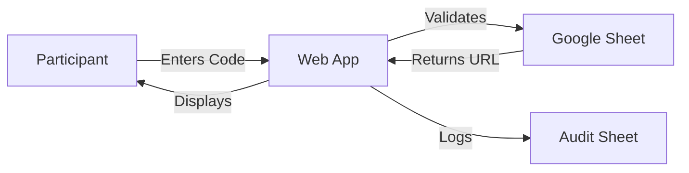

# 🔐 Secure URL Distribution System for Nonprofits

> A free, automated solution for distributing unique URLs to program participants using Google Apps Script

[](https://opensource.org/licenses/MIT)
[](https://nten.org)
[](https://script.google.com)

## 🎯 Purpose

Created for **Ash Shepherd**, Chief Program Officer at [NTEN](https://nten.org), this solution addresses a common nonprofit challenge: securely distributing unique URLs to program participants while maintaining 24/7 availability without staff intervention.

## 🚀 What This Solves

### The Challenge
- Organizations have unique URLs for each program participant
- Each participant has a corresponding access code  
- Manual distribution via email creates delays
- Participants need instant access outside business hours
- Security is critical - participants shouldn't access others' URLs

### The Solution
A simple web application where participants:
1. Enter their unique access code
2. Instantly receive their personal URL on-screen
3. Access the system 24/7 without staff assistance

## ✨ Features

- **🔒 Secure** - Server-side validation ensures URLs never leak
- **⚡ Instant** - Participants get their URL immediately on-screen
- **🛡️ Protected** - Rate limiting prevents brute force attempts
- **📊 Auditable** - Complete logging of all access attempts
- **🎨 Professional** - Clean, mobile-friendly interface
- **💰 Free** - No hosting costs, runs on Google's infrastructure
- **🔧 Easy Maintenance** - Update participants via spreadsheet

## 📸 Screenshots

<details>
<summary>View Interface Examples</summary>

### Entry Form
Clean, professional interface where participants enter their access code:
```
┌─────────────────────────────────┐
│   Retrieve Your Program Link    │
├─────────────────────────────────┤
│                                 │
│  Access Code                    │
│  ┌───────────────────────────┐  │
│  │ Enter your code here      │  │
│  └───────────────────────────┘  │
│                                 │
│  [Get My Link]                  │
│                                 │
└─────────────────────────────────┘
```

### Success Response
Immediate display of the participant's unique URL:
```
┌─────────────────────────────────┐
│        Your Link                │
├─────────────────────────────────┤
│                                 │
│  https://your-program-url.com   │
│                                 │
│  Bookmark it for next time.     │
│                                 │
└─────────────────────────────────┘
```

</details>

## 🏗️ Architecture



## 📋 Prerequisites

- Google Account (free)
- 30-45 minutes for setup
- No coding experience required

## 🛠️ Quick Setup Guide

### Step 1: Copy the Template (2 minutes)
1. [Click here to copy the template spreadsheet](https://docs.google.com/spreadsheets/d/YOUR_TEMPLATE_ID) *(Template coming soon)*
2. Or create a new Google Sheet with these tabs:
   - `Participants` - with columns: Code | URL | Active | Notes
   - `AuditLog` - with columns for logging

### Step 2: Deploy the Web App (10 minutes)
1. From your sheet: **Extensions → Apps Script**
2. Copy the provided code files (see `/src` folder)
3. Update the `SPREADSHEET_ID` in Code.gs
4. **Deploy → New deployment → Web app**
5. Set "Execute as: Me" and "Who has access: Anyone"

### Step 3: Configure Security (5 minutes)
1. In Apps Script: **Project Settings → Script properties**
2. Add `HASH_SALT` with a random 20+ character string
3. Optional: Add reCAPTCHA for bot protection

### Step 4: Test & Share (5 minutes)
1. Test with valid and invalid codes
2. Share the web app URL with participants
3. Keep the spreadsheet private (only share with staff)

## 📁 Repository Structure

```
nten-secure-url-distribution/
├── README.md                 # This file
├── LICENSE                   # MIT License
├── IMPLEMENTATION_GUIDE.md   # Detailed setup instructions
├── SECURITY.md              # Security best practices
├── src/                     # Source code
│   ├── Code.gs             # Server-side logic
│   ├── index.html          # Entry form
│   └── result.html         # Response page
├── docs/                    # Documentation
│   ├── TROUBLESHOOTING.md  # Common issues & solutions
│   ├── MAINTENANCE.md      # Ongoing maintenance guide
│   └── FAQ.md             # Frequently asked questions
└── examples/               # Example configurations
    ├── sample-data.csv    # Sample participant data
    └── config-examples.md # Configuration examples
```

## 🔒 Security Features

- **Rate Limiting**: Blocks repeated failed attempts
- **Code Hashing**: Access codes are never stored in logs
- **Server-Side Validation**: URLs never exposed in client code
- **Audit Trail**: Complete logging of all access attempts
- **Optional CAPTCHA**: Bot protection available
- **High Entropy Codes**: 10+ character recommendations

## 📊 Data Management

### Adding Participants
Simply add rows to your Google Sheet:
```
Code        | URL                          | Active | Notes
------------|------------------------------|--------|-------
ABC123XYZ   | https://program.org/user1    | TRUE   | Cohort A
DEF456UVW   | https://program.org/user2    | TRUE   | Cohort A
```

### Monitoring Usage
The AuditLog sheet tracks:
- Timestamp of each attempt
- Success/failure status
- Anonymized code hash
- Rate limit blocks
- Response times

## 🤝 Contributing

We welcome contributions! Please see [CONTRIBUTING.md](CONTRIBUTING.md) for guidelines.

### Ways to Contribute
- 🐛 Report bugs
- 💡 Suggest features
- 📝 Improve documentation
- 🌍 Add translations
- ⭐ Star this repository

## 📜 License

This project is licensed under the MIT License - see [LICENSE](LICENSE) for details.

## 🙏 Acknowledgments

- **Ash Shepherd** ([@ashshepherd](https://linkedin.com/in/ashshepherd)) - Chief Program Officer at NTEN, for inspiring this solution
- **[NTEN](https://nten.org)** - The Nonprofit Technology Network, empowering nonprofits through technology
- **Google Apps Script Community** - For platform and resources
- **Nonprofit Tech Community** - For continuous feedback and support

## 💬 Support

- **Documentation**: See `/docs` folder for detailed guides
- **Issues**: [Report bugs or request features](https://github.com/joshuamtm/nten-secure-url-distribution/issues)
- **Discussions**: [Join the conversation](https://github.com/joshuamtm/nten-secure-url-distribution/discussions)

## 🚦 Status

- ✅ Production Ready
- ✅ Actively Maintained
- ✅ Security Tested
- ✅ Documentation Complete

## 📈 Roadmap

- [ ] Email notification option
- [ ] Multi-language support
- [ ] Advanced analytics dashboard
- [ ] Bulk import tool
- [ ] API endpoint option

---

<div align="center">

**Built with ❤️ for the nonprofit community**

*Empowering organizations to better serve their participants*

[Get Started](#-quick-setup-guide) • [View Demo](https://demo.example.com) • [Contact Support](mailto:support@example.com)

</div>